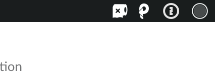
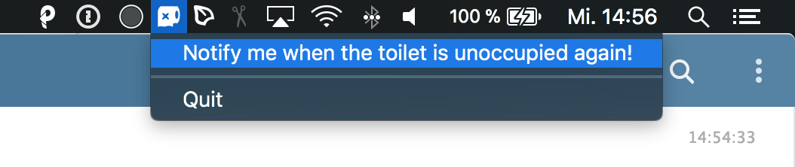
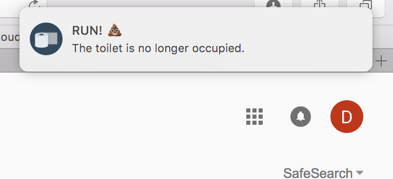
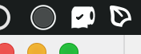

# Klobar

A macOS client for Klobot living in the menu bar.

### Occupied

### When in need register for a notification.

### Know when the time has come!

### Directly see the state of the toilet.

## Credits
Created by [Angelo Cammalleri](https://github.com/ANGOmarcello).

## Attribution
Some code used from [Coca](https://kindred.one/coca/) with friendly permission by [Kindred](https://kindred.one).

App Icon made by Vectors Market from [www.flaticon.com](https://www.flaticon.com/free-icon/toilet-paper_235841#term=toilet&page=1&position=49).

## License
This project is licensed under the terms of the MIT license.
